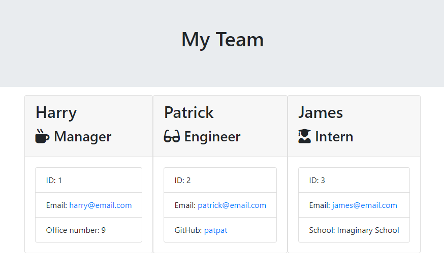

<!-- Improved compatibility of back to top link: See: https://github.com/othneildrew/Best-README-Template/pull/73 -->

<!--
*** Thanks for checking out the Best-README-Template. If you have a suggestion
*** that would make this better, please fork the repo and create a pull request
*** or simply open an issue with the tag "enhancement".
*** Don't forget to give the project a star!
*** Thanks again! Now go create something AMAZING! :D
-->
 

# Team Profile Generator

<!-- ABOUT THE PROJECT -->
## About The Project
 

This is a team profile generator. It is a Node.js CLI app that uses Inquirer to query the user for information regarding a software engineering team, and generates a simple team profile HTML page with summaries for each team member, built using Bootstrap. The aim of this project was to demonstrate my understanding of test-driven development.

  

### Built With
[![Bootstrap][Bootstrap.com]][Bootstrap-url]

## Installation

N/A

<!-- USAGE EXAMPLES -->
## Usage

This is a Node.js app and requires Node.js to be installed. Get Node.js at https://nodejs.org/en/.

Download the repo contents to a new folder and run the app from your preferred CLI using `node index.js`. Answer the questions. Choosing to finalize will generate and save the team profile page to the "output" folder.

<!-- ACKNOWLEDGMENTS -->
## Acknowledgments

* [Best README Template](https://github.com/othneildrew/Best-README-Template/pull/73)

<!-- MARKDOWN LINKS & IMAGES -->
[Bootstrap.com]: https://img.shields.io/badge/Bootstrap-563D7C?style=for-the-badge&logo=bootstrap&logoColor=white
[Bootstrap-url]: https://getbootstrap.com
